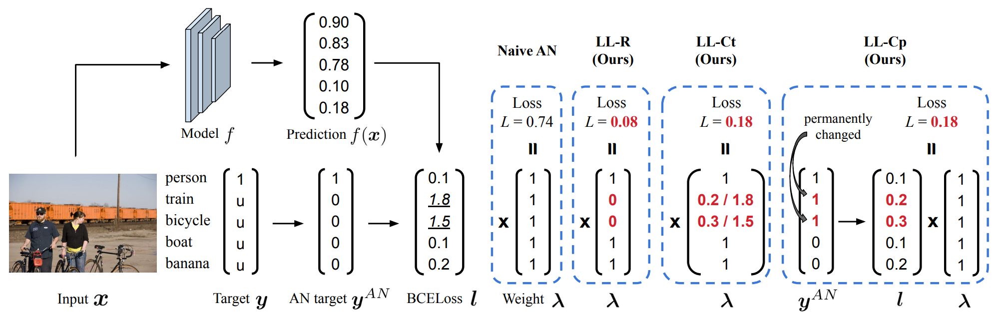
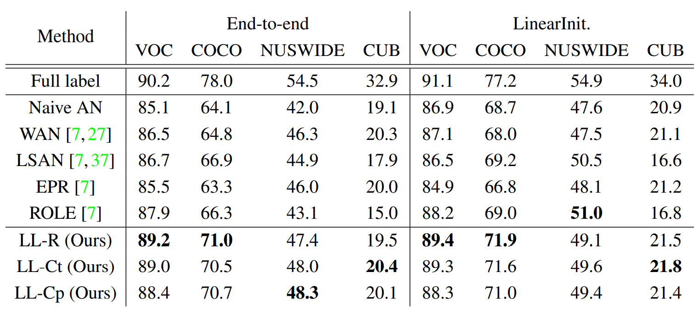
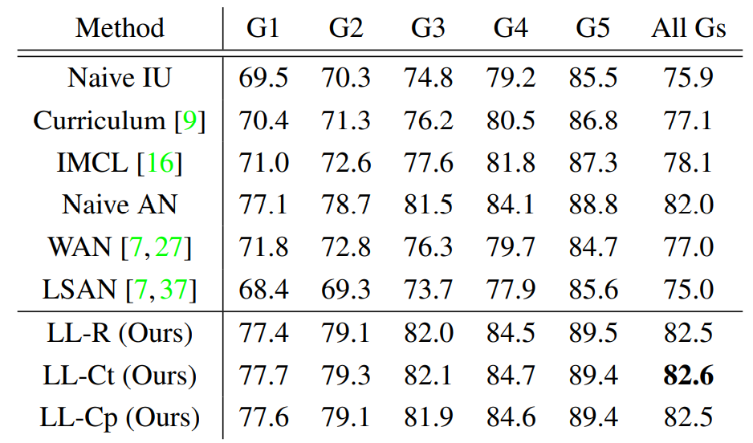
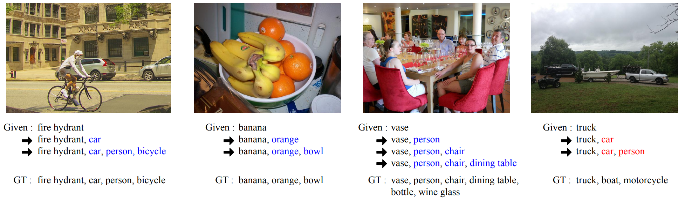

# Large Loss Matters in Weakly Supervised Multi-Label Classification (CVPR 2022) | [Paper](https://arxiv.org/abs/2206.03740)

Youngwook Kim<sup>1*</sup>, Jae Myung Kim<sup>2*</sup>, Zeynep Akata<sup>2,3,4</sup>, and Jungwoo Lee<sup>1,5</sup>

<sup>1</sup> <sub>Seoul National Univeristy</sub>  <sup>2</sup> <sub>University of T&uuml;bingen</sub> 
<sup>3</sup> <sub>Max Planck Institute for Intelligent Systems</sub>  <sup>4</sup> <sub>Max Planck Institute for Informatics</sub> <sup>5</sup> <sub>HodooAI Lab</sub>

Primary contact : [ywkim@cml.snu.ac.kr](ywkim@cml.snu.ac.kr)

<p align="center">
</img>
</p>

## Abstract
Weakly supervised multi-label classification (WSML) task, which is to learn a multi-label classification using partially observed labels per image, is becoming increasingly important due to its huge annotation cost. In this work, we first regard unobserved labels as negative labels, casting the WSML task into noisy multi-label classification. From this point of view, we empirically observe that memorization effect, which was first discovered in a noisy multi-class setting, also occurs in a multi-label setting. That is, the model first learns the representation of clean labels, and then starts memorizing noisy labels. Based on this finding, we propose novel methods for WSML which reject or correct the large loss samples to prevent model from memorizing the noisy label. Without heavy and complex components, our proposed methods outperform previous state-of-the-art WSML methods on several partial label settings including Pascal VOC 2012, MS COCO, NUSWIDE, CUB, and OpenImages V3 datasets. Various analysis also show that our methodology actually works well, validating that treating large loss properly matters in a weakly supervised multi-label classification.

## News ( 2023/4/5 )
Please check out our follow-up paper, [Bridging the Gap between Model Explanations in Partially Annotated Multi-label Classification](https://arxiv.org/abs/2304.01804), which is accepted in CVPR 2023.

## Dataset Preparation
See the `README.md` file in the `data` directory for instructions on downloading and setting up the datasets.

(NEW) We added an instruction for downloading metadata and images for the OpenImages V3 dataset. Please check it.

## Model Training & Evaluation
You can train and evaluate the models by
```
python main.py --dataset [dataset] \
               --mod_scheme [scheme] \
               --delta_rel [delta_rel] \
               --lr [learning_rate] \
               --optimizer [optimizer]
```
where ```[data_path]``` in {pascal, coco, nuswide, cub}, ```[scheme]``` in {LL-R, LL-Ct, LL-Cp}, and 
```[delta_rel]``` in {0.1, 0.2, 0.3, 0.4, 0.5}.

Currently we only support ''End-to-end'' training setting.

## Quantitative Results
Artificially generated partial label datasets      |  Real partial label dataset (OpenImages V3)
:-------------------------:|:-------------------------:
  |  

## Qualitative Results
<p align="center">
</img>
</p>

## How to cite
If our work is helpful, please consider citing our paper.
```
@InProceedings{Kim_2022_CVPR,
    author    = {Kim, Youngwook and Kim, Jae Myung and Akata, Zeynep and Lee, Jungwoo},
    title     = {Large Loss Matters in Weakly Supervised Multi-Label Classification},
    booktitle = {Proceedings of the IEEE/CVF Conference on Computer Vision and Pattern Recognition (CVPR)},
    month     = {June},
    year      = {2022},
    pages     = {14156-14165}
}
```

## Acknowledgements
Our code is heavily built upon [Multi-Label Learning from Single Positive Labels](https://github.com/elijahcole/single-positive-multi-label).
